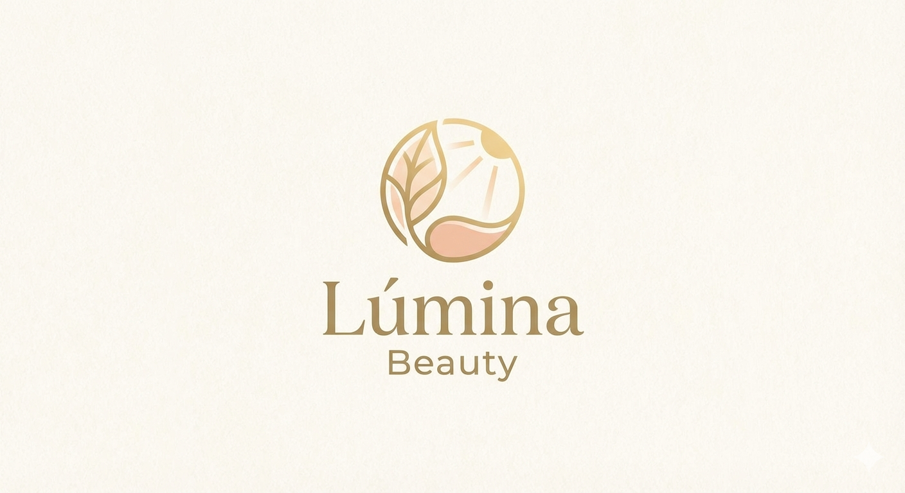

# 💄 Lúmina Beauty - Dashboard de Vendas

## 📋 Sobre o Projeto
Este projeto consiste na criação de um **Dashboard de Vendas** estratégico para a empresa fictícia de cosméticos **Lúmina Beauty**. O objetivo principal é transformar dados brutos de vendas em informações visuais claras, permitindo a análise de desempenho e a tomada de decisões baseadas em dados (Data-Driven).

## 🎯 Desafios de Negócio
Para guiar a construção do dashboard, foram definidas 2 perguntas de negócio fundamentais:

1.  **Faturamento por Produto:** Qual o "carro-chefe" da marca?
2.  **Desempenho Regional:** Qual cidade possui o maior volume financeiro de vendas?

## 📊 Estrutura dos Dados
A base de dados contém **100 registros** fictícios, totalmente normalizados (sem acentuação para garantir compatibilidade com diferentes sistemas).

| Coluna | Descrição |
| :--- | :--- |
| `ID` | Identificador único da venda |
| `Data` | Data da transação (MM/DD/AAAA) |
| `Produto` | Nome do item vendido |
| `Valor` | Preço de venda (BRL) |
| `Cliente` | Nome do comprador |
| `Idade` | Idade do cliente |
| `Cidade` | Localização da venda |

## 🎨 Identidade Visual
A estética do dashboard segue a paleta de cores da **Lúmina Beauty**, focada em sofisticação e tons orgânicos:

* **Dourado Sedoso (#C4A47C):** Destaques e bordas.
* **Pêssego Aura (#E8B4A2):** Barras e elementos secundários.
* **Bronze Profundo (#8E734A):** Textos e eixos.
* **Creme Perolado (#F7F3EE):** Cor de fundo do dashboard.

## 🛠️ Passo a Passo para Reprodução

### 1. Preparação
* Converta os dados brutos em uma **Tabela Oficial (Ctrl + T)** no Excel.
* Nomeie a tabela como `TabelaVendas`.

### 2. Criação dos Gráficos (Tabelas Dinâmicas)
* **Gráfico 1 (Barras):** Linhas: `Produto` | Valores: `Soma de Valor`.
* **Gráfico 2 (Rosca):** Linhas: `Cidade` | Valores: `Soma de Valor`.

### 3. Design e Filtros
* Reúna todos os gráficos em uma única aba limpa.
* Aplique a paleta de cores hexadecimais mencionada acima.
* Insira **Segmentação de Dados** para as colunas `Cidade` e `Produto` para tornar o painel interativo.

## 🚀 Resultado Esperado
O resultado final é um painel interativo onde o usuário pode filtrar por região ou produto e observar instantaneamente o impacto no faturamento total, no perfil de idade e na tendência de crescimento da marca.

---
*Projeto desenvolvido para fins de estudo de análise de dados e visualização.*
